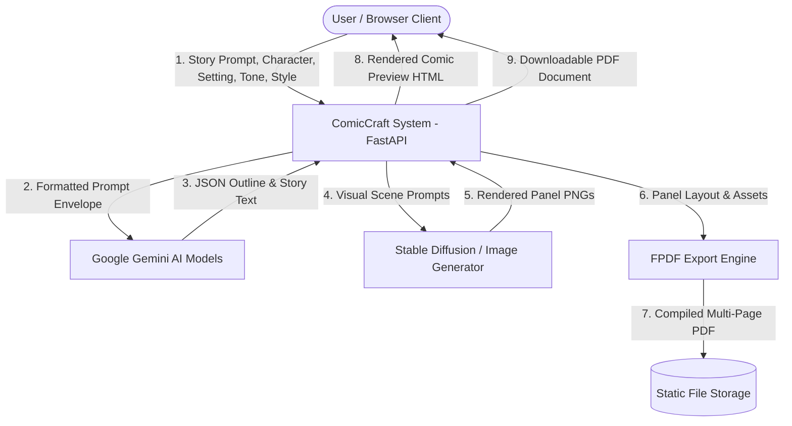
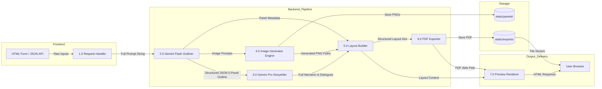

# Phase 2: Requirement Analysis
## Data Flow Diagram (DFD)

### 1. DFD Level 0: Context Diagram
The Level 0 Context Diagram depicts ComicCraft as a single central process interacting with external entities (Users, Google Gemini AI API, Image Generation Engine, and Local File System).

---

### 2. DFD Level 1: Subsystem Decomposition

The Level 1 DFD decomposes the system into its primary operational sub-processes:
1. **Input Ingestion & Validation** (`routes.py`)
2. **5-Panel Outline Generation** (`gemini_flash.py`)
3. **Dialogue & Narration Expansion** (`gemini_pro.py`)
4. **Concurrent Panel Inking** (`image_generator.py`)
5. **Layout Assembly & Binding** (`layout_builder.py`)
6. **PDF Compilation & Storage** (`exporters.py`)
7. **Client Presentation & Download** (`comic_preview.html`, `export_success.html`)

---

### 3. Data Dictionary

| Data Element | Type | Source | Destination | Description |
| :--- | :--- | :--- | :--- | :--- |
| `prompt` | String | User Form / JSON | `generate_outline()` | The core story premise or narrative spark. |
| `character_name` | String | User Form / JSON | `generate_outline()` | Name of the primary character. |
| `setting` | String | User Form / JSON | `generate_outline()` | Environmental context (e.g. Forest, Space). |
| `tone` | String | User Form / JSON | `generate_outline()`, `generate_story()` | Narrative mood (e.g. Dramatic, Funny). |
| `style` | String | User Form / JSON | `image_generator.py` | Visual aesthetic (e.g. Anime, Realistic). |
| `outline` | List[Dict] | `gemini_flash.py` | `gemini_pro.py`, `image_generator.py` | 5 items containing `panel`, `title`, `scene_description`, `image_prompt`. |
| `full_story` | String | `gemini_pro.py` | `layout_builder.py` | Formatted story containing panel titles, dialogues, and captions. |
| `images` | List[Str] | `image_generator.py` | `layout_builder.py`, `static/panels/` | File paths to the saved 5 panel illustrations. |
| `layout` | List[Dict] | `layout_builder.py` | `save_pdf()`, `comic_preview.html` | Unified collection of panels binding images, titles, descriptions, and story text. |
| `pdf_path` | String | `exporters.py` | `comic_preview.html`, `export_success.html` | Absolute and relative path to the generated comic PDF file. |
