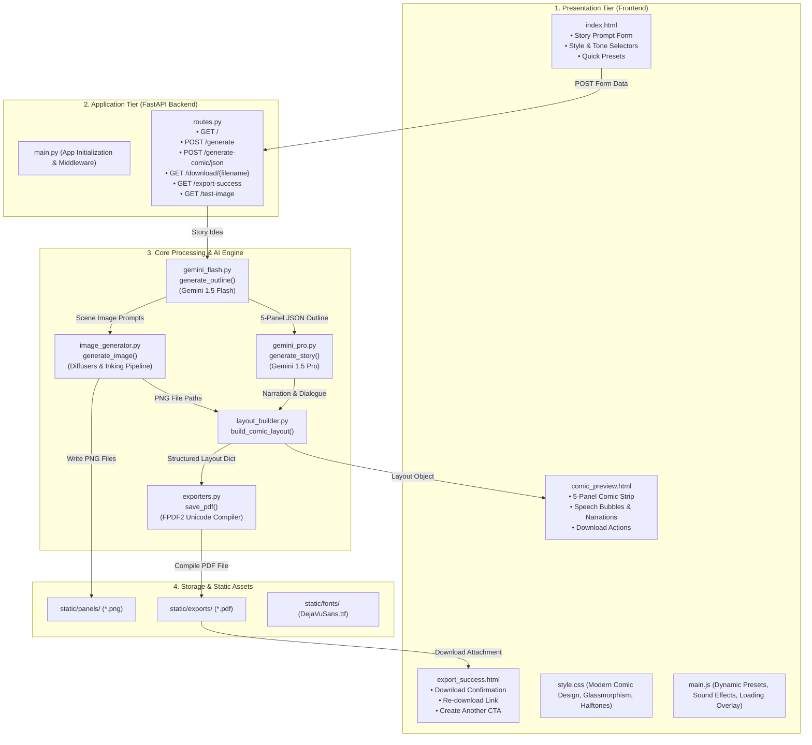

# Phase 3: Project Design Phase
## Solution Architecture

### 1. Architectural Diagram
ComicCraft follows a clean, three-tier modular architecture separating presentation, business logic orchestration, and AI model services:

---

### 2. Component Responsibilities

| Component | File Path | Primary Responsibility |
| :--- | :--- | :--- |
| **Server Entrypoint** | `app/main.py` | Instantiates FastAPI, configures CORS middleware, mounts `/static` file directories, and registers route controllers. |
| **API Router** | `app/routes.py` | Handles incoming HTTP requests, performs input validation via Pydantic, coordinates the AI pipeline, and renders templates. |
| **Panel Outliner** | `app/gemini_flash.py` | Queries Gemini 1.5 Flash with structured system instructions to produce a valid 5-panel JSON storyline array. |
| **Dialogue Expander**| `app/gemini_pro.py` | Queries Gemini 1.5 Pro to expand the outline into comic book narration, environmental captions, and character dialogue. |
| **Image Generator** | `app/image_generator.py`| Inks panel scenes using generative diffusion or artistic illustration pipelines, outputting optimized PNG assets. |
| **Layout Builder** | `app/layout_builder.py` | Extracts title, speech bubble, caption, and narration metadata, mapping them to corresponding panel imagery. |
| **PDF Exporter** | `app/exporters.py` | Formats each panel into a dedicated A4 page with TrueType Unicode fonts and compiles the downloadable PDF document. |

---

### 3. Fault-Tolerance & Resilience Strategy
- **Decoupled Fallback Engine**: If the Gemini API is unreachable or environment keys are absent, both `gemini_flash.py` and `gemini_pro.py` switch to semantic fallback generators that tailor outlines and stories based on user parameters, preventing 500 errors.
- **Concurrent Inking with Cache Check**: In `image_generator.py`, prompt strings are hashed to check for existing panel assets before initiating redundant generation.
- **Unicode Font Handling**: TrueType fonts are loaded with error-handling to prevent character set encoding exceptions in multi-language environments.
